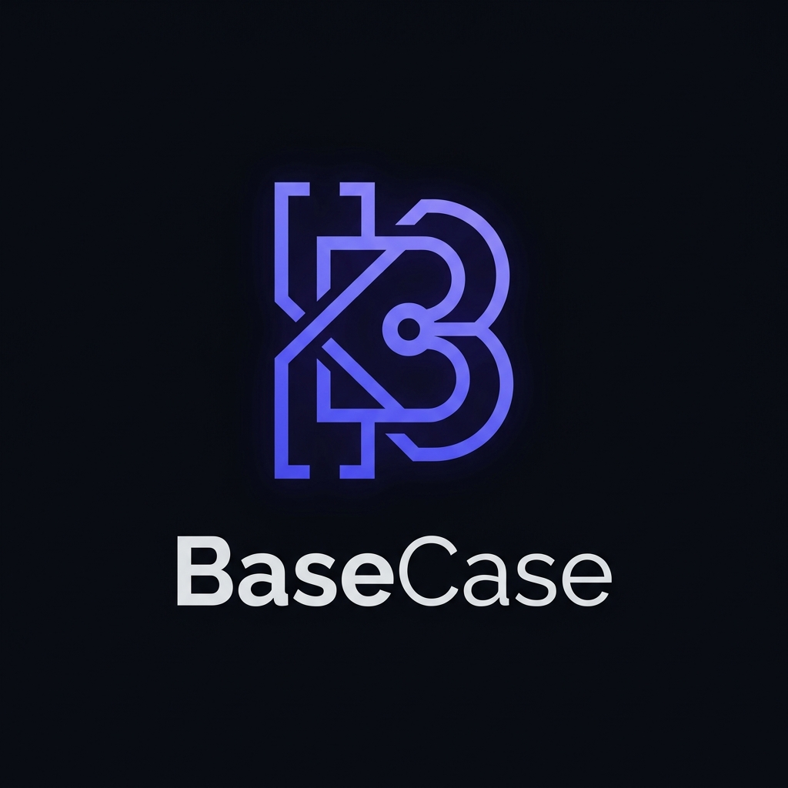

<p align="center">
  
</p>

<h1 align="center">BaseCase</h1>

<p align="center">
  <strong>The Algorithmic Engineering Platform & Deliberate Practice Workspace</strong>
</p>

<p align="center">
  A high-performance full-stack platform designed to transform how engineers master algorithmic problem solving. BaseCase combines deterministic problem synthesis, automated spaced repetition, company-specific tracks, and real-time code execution in an elite developer workspace.
</p>

<p align="center">
  
  
  
  
</p>

---

## 📋 Table of Contents

- [Overview](#-overview)
- [Key Features](#-key-features)
- [Getting Started](#-getting-started)
- [Platform Architecture](#-platform-architecture)
- [Dashboard & Navigation](#-dashboard--navigation)
- [Problems Management](#-problems-management)
- [AI-Powered Features](#-ai-powered-features)
- [Spaced Repetition System](#-spaced-repetition-system)
- [Practice Modes](#-practice-modes)
- [Analytics & Insights](#-analytics--insights)
- [Company Readiness](#-company-readiness)
- [Integrated Code Editor](#-integrated-code-editor)
- [Learn System](#-learn-system)
- [API Reference](#-api-reference)
- [Tech Stack](#-tech-stack)

---

## 🌟 Overview

TufTracker is an all-in-one DSA preparation platform that goes beyond simple problem tracking. Built with a **pixel-perfect LeetCode-inspired UI**, it provides:

- **Intelligent Problem Analysis** using a hybrid cache → preloaded data → AI fallback system
- **Scientifically-backed Spaced Repetition** to optimize long-term retention
- **Company-specific Interview Preparation** with targeted practice sessions
- **Real-time Java Code Execution** with an integrated development environment
- **AI Study Notes Generation** with comprehensive solution approaches
- **Activity Tracking** with heatmaps, streaks, and detailed analytics

The platform contains a preloaded database of **2000+ curated problems** from LeetCode, GeeksforGeeks, and top interview lists, automatically categorized across **30+ DSA topics** and **50+ algorithmic patterns**.

---

## 🚀 Key Features

| Feature | Description |
|---------|-------------|
| 🧠 **AI Problem Analysis** | Auto-detect topics, patterns, difficulty, and solution approaches |
| 📚 **Smart Study Notes** | Generate comprehensive notes with intuition, approaches, and complexity analysis |
| 🔄 **Spaced Repetition** | SM-2 algorithm implementation for optimal revision scheduling |
| 🏢 **Company Focused Practice** | Generate interview questions specific to FAANG and other top companies |
| 💻 **Integrated Code IDE** | Write, run, and test Java code directly in the browser |
| 📊 **Analytics Dashboard** | Track progress with heatmaps, charts, and performance metrics |
| 🎯 **Pattern Practice** | Practice problems grouped by algorithmic patterns |
| 📝 **Learn System** | Master DSA concepts with AI-generated learning material |
| ⚡ **Edge Case Generator** | AI-powered test case generation for thorough testing |
| 🔥 **Streak Tracking** | Stay motivated with daily streak monitoring |

---

## ⚙️ Getting Started

### Prerequisites

- **Node.js** v18 or higher
- **npm** or **yarn** package manager
- **Firebase** account with Firestore and Authentication enabled
- **Google Gemini API** key for AI features

### Backend Setup

```bash
# Navigate to backend directory
cd backend

# Install dependencies
npm install

# Create environment file
cp .env.example .env
```

Configure `.env` with your credentials:

```env
# Firebase Configuration
FIREBASE_SERVICE_ACCOUNT=<your-service-account-json>

# AI Configuration
GEMINI_API_KEY=<your-gemini-api-key>

# Server Configuration
PORT=5000
```

```bash
# Start the server
npm start

# Development mode with hot-reload
npm run dev
```

The backend server runs at `http://localhost:5000`

### Frontend Setup

```bash
# Navigate to frontend directory
cd frontend

# Install dependencies
npm install

# Create environment file
cp .env.example .env
```

Configure Firebase credentials in `.env`:

```env
VITE_FIREBASE_API_KEY=<your-api-key>
VITE_FIREBASE_AUTH_DOMAIN=<your-auth-domain>
VITE_FIREBASE_PROJECT_ID=<your-project-id>
VITE_FIREBASE_STORAGE_BUCKET=<your-storage-bucket>
VITE_FIREBASE_MESSAGING_SENDER_ID=<your-sender-id>
VITE_FIREBASE_APP_ID=<your-app-id>
```

```bash
# Start development server
npm run dev
```

The frontend runs at `http://localhost:5173`

---

## 🏗️ Platform Architecture

```
┌─────────────────────────────────────────────────────────────────┐
│                         FRONTEND                                 │
│  ┌─────────────┐  ┌─────────────┐  ┌─────────────┐              │
│  │   React 18  │  │   Zustand   │  │   Vite      │              │
│  │  Components │  │   Stores    │  │   Bundler   │              │
│  └─────────────┘  └─────────────┘  └─────────────┘              │
└───────────────────────────┬─────────────────────────────────────┘
                            │ REST API
┌───────────────────────────▼─────────────────────────────────────┐
│                         BACKEND                                  │
│  ┌─────────────┐  ┌─────────────┐  ┌─────────────┐              │
│  │  Express.js │  │  AI Service │  │ Code Runner │              │
│  │   Routes    │  │  (Gemini)   │  │   (Java)    │              │
│  └─────────────┘  └─────────────┘  └─────────────┘              │
│         │                │                │                      │
│  ┌──────▼────────────────▼────────────────▼──────┐              │
│  │              Hybrid Caching System            │              │
│  │    Cache → Preloaded Data → AI Fallback       │              │
│  └───────────────────────┬───────────────────────┘              │
└──────────────────────────┼──────────────────────────────────────┘
                           │
┌──────────────────────────▼──────────────────────────────────────┐
│                      DATA LAYER                                  │
│  ┌─────────────┐  ┌─────────────┐  ┌─────────────┐              │
│  │  Firestore  │  │   Firebase  │  │  Preloaded  │              │
│  │  Database   │  │    Auth     │  │    Data     │              │
│  └─────────────┘  └─────────────┘  └─────────────┘              │
└─────────────────────────────────────────────────────────────────┘
```

---

## 📱 Dashboard & Navigation

### Main Dashboard

The dashboard serves as the central hub of TufTracker, featuring:

- **Collapsible Sidebar Navigation** for accessing all platform sections
- **Auto-hiding Header** that appears when scrolling up for distraction-free work
- **Streak Display** showing consecutive days of problem-solving activity
- **Quick Navigation** to Problems, Companies, Revision, Analytics, and Learn

### Sidebar Navigation

| Section | Description |
|---------|-------------|
| **Problems** | View, add, and manage all your tracked problems |
| **Companies** | Explore company-wise problem collections and readiness scores |
| **Revision** | Access spaced repetition dashboard with due problems |
| **Analytics** | Deep dive into your progress metrics and statistics |
| **Learn** | Generate AI learning notes for DSA concepts |

---

## 📝 Problems Management

### Problem List View (`/problems`)

The Problems page displays all your tracked problems with powerful filtering and sorting:

**Features:**
- **Advanced Filtering** by status (All, Pending, Solving, Solved), difficulty, topics, and patterns
- **Search Functionality** to quickly find problems by title
- **Batch Actions** for efficient problem management
- **Problem Cards** showing difficulty, status, topics, patterns, and company tags

**Use Case:**
> Efficiently manage hundreds of tracked problems. Quickly find "Medium" difficulty "Dynamic Programming" problems to solve next, or verify which problems are still "Pending".

### Problem View Page (`/problem/:id`)

A comprehensive problem details interface inspired by LeetCode:

**Features:**
- **Problem Description**: Full markdown rendering with constraints and examples.
- **Personal Notes**: Markdown-enabled notes for jotting down your own thoughts.
- **AI Study Mode**: Instant access to generated solutions and intuition.

**Use Case:**
> Solve a problem in a focused environment. Use the notes section to write down your initial thought process, then verify your approach against the AI-generated study notes.

---

## 🤖 AI-Powered Features

TufTracker leverages **Google Gemini AI (3 Flash preview)** to provide intelligent assistance throughout your preparation:

### 1. Hybrid Problem Analysis

When you add a problem, the system uses a **3-tier analysis approach**:

```
1. Cache Check → Instant retrieval of previously analyzed problems
         ↓
2. Preloaded Database → Match against 2000+ pre-analyzed problems
         ↓
3. AI Fallback → Fresh analysis using Gemini for new problems
```

**Use Case:**
> Instantly get metadata (Difficulty, Topics, Patterns, Companies) for any problem you add, without manually looking it up. Saves time and ensures accurate categorization for analytics.

### 2. AI Study Notes Generation

Generate comprehensive study material for any problem:

- **Intuition**: The "aha!" moment or key insight required.
- **Approaches**: Detailed breakdown of Brute Force vs. Optimal solutions.
- **Complexity**: Time & Space analysis for each approach.

**Use Case:**
> Stuck on a hard problem? Generate study notes to understand the core concept without just memorizing code. Great for post-solution review to ensure you found the most optimal approach.

### 3. Problem Description Generation

For interview practice modes, AI generates complete problem statements including examples, constraints, and edge cases.

**Use Case:**
> Simulates a real interview scenario where you are given a fresh, unseen problem statement that you must interpret and solve.

### 4. AI Problem Help

Get contextual hints without revealing the full solution:
- **Approach Hints** - Nudges in the right direction
- **Pattern Recognition** - Identify which algorithm pattern to use

**Use Case:**
> When you are blocked but don't want to give up. Use a hint to get unstuck while still solving the core logic yourself.

### 5. Edge Case Generation

Automatically generate comprehensive test cases, including boundary conditions (empty inputs, max values).

**Use Case:**
> ensuring your solution is robust. Often candidates fail because they missed edge cases (e.g., null array, single element). This feature automates that check.

### 6. Learning Notes Generation

Generate in-depth learning material for DSA topics and patterns.

**Use Case:**
> Learning a new concept like "Segment Trees" or "KMP Algorithm" from scratch. Provides a structured tutorial with code templates and examples.

---

## 🔄 Spaced Repetition System

TufTracker implements the **SM-2 (SuperMemo 2) algorithm** for scientifically-optimized revision scheduling.

### How It Works

1. **Add Problem to Revision** - After solving a problem, add it to your revision queue
2. **Scheduled Reviews** - Problems appear on specific dates based on performance
3. **Performance Grading** - Rate your recall quality (1-5 scale)
4. **Adaptive Scheduling** - Interval adjusts based on your performance (e.g., 1 day -> 3 days -> 7 days).

**Use Case:**
> Solved "Invert Binary Tree" today? The system ensures you review it just before you are likely to forget it, cementing it in long-term memory so you are ready for your interview months from now.

### Revision Dashboard (`/revision`)

The central hub for your daily reviews.

- **Due Today**: List of problems that need attention right now.
- **Guided Review**: A modal that walks you through the review process (Read -> Recall -> Rate).

**Use Case:**
> Start your day by clearing your "Due Today" queue. This 15-20 minute daily habit ensures you retain 100% of the problems you've solved previously.

---

## 🎯 Practice Modes

TufTracker offers multiple practice modes for targeted interview preparation:

### 1. Interview Practice Mode

Generate fresh, never-seen-before problems for mock interview simulation.

**Use Case:**
> Simulating a real 45-minute technical interview. You get a random problem of a specific difficulty and have to solve it under time pressure. Perfect for testing your "cold" solving ability.

### 2. Pattern Focus Mode

Master specific algorithmic patterns like **Sliding Window**, **Two Pointers**, **Dynamic Programming**, etc.

**Use Case:**
> You realized you are weak at "Dynamic Programming". Use this mode to drill 5-10 DP problems in a row until the pattern clicks.

### 3. Company Focus Mode

Prepare for specific company interviews (Google, Amazon, Meta, etc.).

**Use Case:**
> Your Google interview is in 2 weeks. Use this mode to only solve problems frequently asked by Google in the last 6 months, maximizing your chances of success.

### 4. Solve Problems Mode

Practice with your existing problem collection. Randomly picks a problem from your list.

**Use Case:**
> General daily practice when you don't have a specific focus but want to keep your skills sharp.

---

## 📊 Analytics & Insights

### Analytics Dashboard (`/analytics`)

Comprehensive statistics and visualizations:

**Visualizations:**

**1. Activity Heatmap**
> **Use Case:** Visualizing your consistency. A full green grid motivates you to not break the chain.

**2. Difficulty Distribution (Pie Chart)**
> **Use Case:** Ensuring you are not just solving "Easy" problems. Helps you balance your diet of Easy/Medium/Hard.

**3. Topic Progress (Radar Chart)**
> **Use Case:** Quickly spotting weak areas. If your "Graphs" axis is short, you know where to focus your next study session.

**4. Company Readiness (Bar Chart)**
> **Use Case:** Tracking how close you are to being "Google Ready" or "Amazon Ready" based on solved problem coverage.

---

## 🏢 Company Readiness

### Companies Page (`/companies`)

Track and prepare for company-specific interviews.

**Features:**
- **Readiness Score**: A 0-100% metric based on problems solved, difficulty, and recency.
- **Company Lists**: Curated lists of top questions for each tech giant.

**Use Case:**
> You have an Amazon interview coming up. This page tells you exactly which Amazon-tagged problems you haven't solved yet and gives you a readiness score to gauge your preparation level.

---

## 💻 Integrated Code Editor

### Code Panel Component

A full-featured code development environment in the browser.

**Features:**
- **Syntax Highlighting**: VSCode-like experience for Java.
- **Test Panel**: Write custom test cases or import AI-generated ones.
- **Code Runner**: Securely executes your Java code and returns standard output/errors.

**Use Case:**
> Complete end-to-end practice. You don't need to switch to IntelliJ or Eclipse. Write code, debug with print statements, run against edge cases, and verify correctness all within TufTracker.

---

## 📖 Learn System

### Learn Page (`/learn`)

Master DSA concepts with AI-generated educational content.

**Generated Content Includes:**
- **Concept Overview**: Real-world analogies.
- **Core Approach**: Step-by-step methodology.
- **Template Code**: Standard, reusable code snippets for patterns (e.g., standard bfs template).

**Use Case:**
> You forgot how "Topological Sort" works. Instead of watching a 20-minute video, generate a concise learning note that gives you the concept, the template code, and 3 example problems to practice.

---

## 📡 API Reference

### Problems API

| Endpoint | Method | Description |
|----------|--------|-------------|
| `/api/problems` | GET | Fetch all user problems |
| `/api/problems` | POST | Add new problem with AI analysis |
| `/api/problems/:id` | PUT | Update problem details |
| `/api/problems/:id` | DELETE | Remove problem |
| `/api/problems/:id/notes` | PUT | Update problem notes |

### Revision API

| Endpoint | Method | Description |
|----------|--------|-------------|
| `/api/revisions` | GET | Get all revision entries |
| `/api/revisions/due-today` | GET | Get problems due for review |
| `/api/revisions/:id/review` | POST | Submit review with quality rating |
| `/api/revisions/overdue` | GET | Get overdue problems |

### AI API

| Endpoint | Method | Description |
|----------|--------|-------------|
| `/api/ai/analyze` | POST | Analyze problem topics/patterns |
| `/api/ai/study-notes` | POST | Generate study notes |
| `/api/ai/problem-help` | POST | Get hints for a problem |
| `/api/ai/generate-problem` | POST | Generate new problem |
| `/api/ai/edge-cases` | POST | Generate test cases |
| `/api/ai/learning-notes` | POST | Generate learning material |

### Code Runner API

| Endpoint | Method | Description |
|----------|--------|-------------|
| `/api/code/run` | POST | Execute Java code |

### Analytics API

| Endpoint | Method | Description |
|----------|--------|-------------|
| `/api/analytics/overview` | GET | Get summary statistics |
| `/api/analytics/heatmap` | GET | Get activity data |
| `/api/analytics/company-readiness` | GET | Get company scores |

---

## 🛠️ Tech Stack

### Frontend

| Technology | Purpose |
|------------|---------|
| **React 18** | UI component library |
| **Vite** | Build tool and dev server |
| **Zustand** | Lightweight state management |
| **React Router** | Client-side routing |
| **TailwindCSS** | Utility-first styling |
| **Recharts** | Data visualization |
| **Lucide Icons** | Icon library |
| **React Syntax Highlighter** | Code highlighting |
| **React Markdown** | Markdown rendering |

### Backend

| Technology | Purpose |
|------------|---------|
| **Node.js** | JavaScript runtime |
| **Express.js** | Web framework |
| **Firebase Admin SDK** | Backend Firebase access |
| **Google Generative AI** | Gemini AI integration |
| **Node Cron** | Scheduled tasks |

### Data & Auth

| Technology | Purpose |
|------------|---------|
| **Firebase Firestore** | NoSQL database |
| **Firebase Auth** | User authentication |
| **In-memory Cache** | Fast data access |
| **Preloaded JSON** | 2000+ problem database |

### Design System

The platform uses a **LeetCode-inspired dark theme**:

| Element | Color Code |
|---------|------------|
| Background | `#1a1a1a` |
| Card Background | `#262626` |
| Brand Orange | `#ffa116` |
| Easy | `#00b8a3` |
| Medium | `#ffc01e` |
| Hard | `#ef4743` |

---

## 🎨 UI/UX Highlights

- **Glassmorphism effects** on cards and modals
- **Smooth transitions** for all interactions
- **Auto-hiding header** for focused work
- **Responsive sidebar** that can be collapsed
- **Dark mode optimized** for extended coding sessions
- **Keyboard shortcuts** for power users
- **Loading states** with skeleton screens
- **Toast notifications** for feedback

---

<p align="center">
  <strong>Built with 💻 and ☕ for aspiring software engineers</strong>
</p>

<p align="center">
  
</p>
